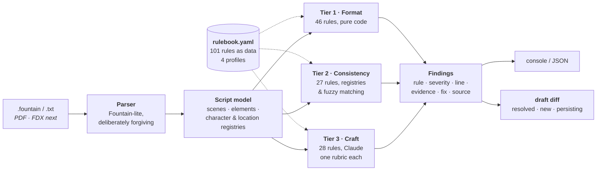

# Sluglint

**A linter for screenplays.** Every note it gives you cites a rule — with a
severity, a line number, a source, and a suggested fix. Never an AI's opinion
about whether your story is good.


---

## What it does, in one paragraph

On a film set, the **script supervisor** catches the errors nobody else sees:
the character whose name changed spelling on page 40, the scene that's suddenly
daytime, the prop that was introduced and never came back. Sluglint does that
pass on your draft, in under a second, before anyone else reads it. It reads
`.fountain` and plain text, and it tells you exactly what's wrong, where, why,
and what rule says so.

```console
$ sluglint lint the_last_train.fountain

Sluglint — The Last Train
7 scenes | ~1.1 pages | 5 speaking characters | profile: us-spec-feature
========================================================================
[E] C001 Character name drift @ script
    Character cues 'JOHN' and 'JON' look like the same person (similarity 0.86).
    > JOHN | JON
    fix: 'JOHN' speaks in scenes [0, 1, 4, 5, 6], 'JON' in [3]. Pick one spelling.
    rule source: SpecConv; ProdConv
[W] C004 Day/night whiplash @ L56
    Scenes 3-5 flip DAY -> NIGHT -> DAY at the same location.
    > EXT. TRAIN YARD - DAY | EXT. TRAIN YARD - NIGHT | EXT. TRAIN YARD - DAY
    fix: If a full day passes, cue it (LATER / NEXT DAY); otherwise fix the slugline.
    rule source: ProdConv (continuity practice)
[S] F005 Camera direction in a spec script @ L28
    Camera direction 'ANGLE ON' in a spec script.
    fix: Describe the image instead of the shot.
------------------------------------------------------------------------
1 errors, 9 warnings, 6 suggestions
```

## What it deliberately does **not** do

Sluglint checks the screenplay **as a document**: formatting, internal
consistency of characters and locations and time, and craft rules about how
scenes and lines are written.

It does **not** judge whether your plot works. Story logic, premise, and whether
the third act earns its ending are for a reader, not a linter.

That restraint is the whole point. The AI-coverage market sells subjective
opinions dressed up as analysis. Sluglint claims only what is **verifiable** —
which means, unlike any coverage tool, its accuracy can actually be measured.

---

## Quickstart

```bash
pip install -e ".[dev]"        # add ,llm for the Claude tier

sluglint rules                                   # browse all 101 rules
sluglint lint script.fountain                    # tiers 1+2 — free, no API key
sluglint lint script.fountain --llm --json out.json
sluglint diff draft1.fountain draft2.fountain    # what did I actually fix?

pytest -q                                        # 113 tests
```

`sluglint lint` exits **1** when it finds an error and **0** otherwise, so it
drops straight into a pre-commit hook or CI on a script repo.

The LLM tier needs `ANTHROPIC_API_KEY` (model via `SLUGLINT_MODEL`, default
`claude-sonnet-5`). **No key? Tiers 1–2 still run** and tier 3 reports itself
skipped — the free 73 rules never depend on a network call.

---

## How it works: three tiers, cheapest first

Checks are **cost-tiered**. Deterministic where possible, structured where
useful, LLM-judged only where genuinely necessary.



| Tier | Rules | Catches | Cost |
|:---:|:---:|---|:---:|
| **1** Format | 46 | Malformed sluglines, orphan cues, walls of text, camera direction, dangling parentheticals, pagination artifacts left over from a PDF, smart quotes that break production software, exclamation/ellipsis/ALL-CAPS overuse | **free** |
| **2** Consistency | 27 | `JOHN` vs `JON` name drift, characters who vanish in act three, DAY→NIGHT→DAY whiplash, a location spelled two ways, an unclosed FLASHBACK, a prop introduced and never paid off, a lead absent for a quarter of the script | **free** |
| **3** Craft | 28 | Unfilmable interiority, on-the-nose dialogue, exposition dumps, interview-shaped scenes, monologues nobody resists, tense drift, passive voice, novelistic prose | ~$0.01–0.05 |

Tiers 1 and 2 are **100% precision by construction** — they answer questions
with one right answer. That is why they're free and why they run every time.

---

## Four profiles, one rulebook

The same page can be a defect in one context and mandatory in another. Scene
numbers are an amateur tell on a spec script and a hard requirement on a
shooting script. Sluglint keeps both rules and lets the profile decide.

```console
$ sluglint lint --profile shooting-script production_draft.fountain
[E] F040 Scene numbers duplicated or out of sequence @ L56
[E] F039 Shooting script without scene numbers @ L60
```

| Profile | Rules | What changes |
|---|:---:|---|
| `us-spec-feature` *(default)* | 90 | No scene numbers, no camera direction, 90–120 pages |
| `tv-pilot` | 94 | Act markers required, act-length balance, half-hour vs one-hour page bands |
| `shooting-script` | 90 | Scene numbers **required** and must be sequential; camera direction permitted |
| `indian-regional` | 93 | Song sequences as scheduled blocks, INTERVAL placement, mixed-script cue consistency |

---

## Rules are data, not code

The product is [`src/sluglint/rulebook.yaml`](src/sluglint/rulebook.yaml). Every rule carries
an **original formulation** of the principle plus a source attribution —
Trottier's and Riley's formatting conventions, Field's structure paradigm,
McKee's craft principles, Snyder's beat placement, Goldman's scene economy,
documented production practice. No book text is reproduced, ever.

```yaml
- id: S001
  name: Unfilmable interiority in action lines
  tier: 3
  severity: warning
  principle: >
    Action lines may only contain what a camera can photograph or a
    microphone can record. Thoughts, memories, and feelings with no
    visible behavior are unfilmable and must be externalized.
  source: Trottier; McKee
  examples:
    - bad:  "John is secretly furious but decides to hide it."
      good: "John smiles. His knuckles whiten around the glass."
```

Thresholds live in the YAML too, never as constants in Python:

```yaml
- id: F004
  detect: long_action_block
  params: {max_lines: 4}       # change this, change the behaviour
```

Adding a tier-3 rule requires **zero code** — the judge builds its rubric from
the YAML. Adding a tier-1/2 rule requires one small generator:

```python
@detector("long_action_block")
def long_action_block(script: Script, rule: Rule):
    limit = int(rule.params.get("max_lines", 4))     # from the rulebook, not here
    ...
```

`sluglint rules --check` fails if any rule in the YAML has no implementation, so
the rulebook can never quietly promise a check it doesn't run.

---

## Draft comparison — the part writers actually come back for

```console
$ sluglint diff the_last_train.fountain the_last_train_v2.fountain

Findings: 9 resolved, 4 new, 7 persisting

RESOLVED:
  [E] C001 Character name drift — 'JOHN' and 'JON' look like the same person
  [W] C004 Day/night whiplash — Scenes 3-5 flip DAY -> NIGHT -> DAY
  [W] F004 Wall-of-text action block — Action block runs 6 lines (max 4)
NEW:
  [S] F005 Camera direction in a spec script — 'CLOSE ON'
```

Findings are fingerprinted by **rule + normalized evidence**, deliberately
excluding line numbers. A note survives the text moving to another page and dies
only when the defect is actually fixed. Re-upload every draft; watch the error
count fall.

---

## How the LLM tier is built

Tier 3 is engineered like an eval harness, not a chatbot:

1. **One scoped rubric per rule** — id, principle, few-shot violates/acceptable
   pairs. Never a single "critique this script" prompt.
2. **Scene-window chunking** with a global context header (title + character
   registry) so judgments stay grounded without burning tokens.
3. **Schema-enforced output** — the API validates the response against a JSON
   schema, so a malformed reply is impossible by construction.
4. **Hallucination filtering in the caller** — findings are dropped unless the
   rule id exists, the scene index is in-window, and the evidence string appears
   **verbatim** in the submitted text. This converts *"the model said so"* into
   *"the model said so and the text confirms it."*
5. **Thinking off, effort low, on purpose** — `max_tokens` caps thinking *plus*
   output, and a truncated findings array is worse than a shallower judgment.
   This is rubric extraction, not open-ended reasoning.
6. **Per-rule confidence thresholding** at report time.

A missing API key never crashes anything. Tiers 1–2 run and tier 3 reports
itself skipped.

---

## How accuracy is measured

Most of a linter's value is in what it *doesn't* say. The test suite is built
around that:

- **`test_every_rule_fires`** — every one of the 73 deterministic rules has a
  minimal positive fixture that must produce exactly that rule id. A rule that
  can't be made to fire is decoration, and `test_snippet_coverage_is_complete`
  fails if any rule lacks one.
- **`test_clean_script_stays_clean`** — a deliberately defect-free script must
  produce **zero** errors and warnings, in **every** profile. This is the gate
  that matters. A linter that cries wolf gets uninstalled.
- **`test_metric_findings_keep_a_stable_fingerprint`** — script-level metrics
  must not churn the draft diff when a count moves by one.

Where a naive check would over-fire, the handler is deliberately narrowed. The
prop rule only fires on `a REVOLVER` / `the LOCKET` — an article is what tells
you it's a prop and not a sound effect. The character-introduction rules anchor
on an age parenthetical. The bad-separator rule only fires immediately before a
*recognised* time of day, so `DRIVE-IN` stays clean.

Next: **fault-injection evals** — mutate clean scripts into labelled defects,
measure per-rule precision and recall, and gate every rule release on a
precision bar. The fixture pair in `examples/` is the seed of that harness.

---

## Where this sits in the market

Existing tools split cleanly into two camps, and neither does this job:

| | What they sell | What they can't tell you |
|---|---|---|
| **Screenwriting software** (Final Draft, WriterDuet, Celtx, Trelby, Fade In) | Formatting *as you type* | Whether the draft you already have is internally consistent |
| **AI coverage** (Greenlight, Prescene, ScriptReader.ai, ScreenplayIQ) | Subjective assessment — plot, character, marketability, a score | Anything falsifiable. There is no way to measure whether the score is right |

Sluglint is the missing third thing: **objective, verifiable, cited defects at
lint speed**, on a draft written in any tool. It's complementary to both —
run it before you pay $29–$209 for coverage, so the reader spends their
attention on your story instead of your typos.

Full analysis, including pricing and a defensibility assessment:
[`docs/competitive-landscape.md`](docs/competitive-landscape.md).

---

## Product levels

Open core: the engine and the whole rulebook are MIT and stay that way.

| | **1 · CLI + rulebook** | **2 · Hosted** | **3 · Production** |
|---|---|---|---|
| | Free, MIT, forever | For working writers | For writers' rooms and production |
| **Who** | Writers who live in a terminal; devs | Writers who want a web app and draft history | Showrunners, line producers, script coordinators |
| **What** | 101 rules, 4 profiles, CLI, JSON, draft diff, CI exit codes | Everything in 1 + annotated script view, accept/dismiss per finding, draft timeline, PDF/FDX import, hosted LLM tier | Everything in 2 + shared team rulebooks, breakdown exports, cast/location/night-shoot reports, API, SSO |
| **Why pay** | — | You don't want to run Python or hold an API key | The rulebook becomes your house style, enforced across every script |

The write-up — pricing hypotheses, what's deliberately *not* paywalled, and why
open core over freemium — is in
[`docs/product-and-business-model.md`](docs/product-and-business-model.md).

---

## Repo layout

```
src/sluglint/rulebook.yaml            THE PRODUCT — 101 rules as data, 4 profiles
src/sluglint/
  parser.py                    Fountain-lite → Script/Scene/Element
  models.py                    dataclasses + Finding (with diff fingerprint)
  rulebook.py                  YAML loader + profile filtering
  lint/registry.py             @detector registry; the only rule→code mapping
  lint/tier1_format.py         how elements are written (46 rules)
  lint/tier1_metrics.py        document ratios + profile structure rules
  lint/tier2_consistency.py    registries, timeline, fuzzy matching (27 rules)
  lint/tier2_production.py     cast size, location load, night ratio
  lint/tier3_llm.py            Claude rubric judges (28 rules, zero rule code)
  diff.py                      draft comparison
  report.py                    console / JSON rendering
  cli.py                       lint | diff | rules
examples/                      fixtures: one clean, one per profile, a v1→v2 pair
tests/                         113 tests; seed of the eval harness
docs/                          competitive landscape, product & business model
```

---

## Roadmap

- [x] **v0.1** — three-tier engine, 101-rule rulebook, 4 profiles, draft diffing, CLI, 113 tests
- [ ] Fault-injection eval harness with per-rule precision/recall gates (ship bar: ≥0.9 precision)
- [ ] PDF + FDX ingestion into the same script model
- [ ] LLM-extracted story bible (props, story days) feeding new tier-2 checks
- [ ] Findings cache keyed by (scene hash, rule, model) — re-lints of unchanged scenes are free
- [ ] FastAPI service + web UI: annotated script view, accept/dismiss feedback loop
- [ ] Rulebook to ~200 rules; more profiles (stage play, radio, documentary)
- [ ] Pacing analytics · character-voice stylometry · producibility score · FDX export with notes

---

## License & a note on sources

MIT. Rule principles are **original formulations** written for this project;
`source:` fields attribute the books and conventions where the underlying ideas
are taught. No copyrighted text is reproduced, and none should ever be added —
see [CONTRIBUTING.md](CONTRIBUTING.md).

---

*Built by **Abhi** — AI/ML engineer and screenwriter. Two obsessions, one linter.*
