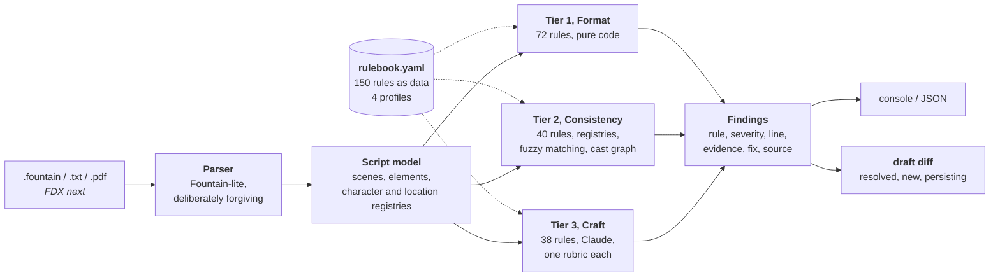

# Sluglint

**A linter for screenplays.** Every note it gives you cites a rule, with a
severity, a line number, a source, and a suggested fix. It never offers an
opinion about whether your story is good.


---

## What it does

On a film set, the script supervisor catches the errors nobody else sees: the
character whose name changed spelling on page 40, the scene that is suddenly
daytime, the prop that was introduced and never came back. Sluglint does that
pass on your draft in under a second, before anyone else reads it. It reads
`.fountain`, plain text, and PDF, and tells you what is wrong, where, why, and
which rule says so.

```console
$ sluglint lint the_last_train.fountain

Sluglint: The Last Train
7 scenes | ~1.1 pages | 5 speaking characters | profile: us-spec-feature
========================================================================
[E] C001 Character name drift @ script
    Character cues 'JOHN' and 'JON' look like the same person (similarity 0.86).
    > JOHN | JON
    fix: 'JOHN' speaks in scenes [0, 1, 4, 5, 6], 'JON' in [3]. Pick one spelling.
    rule source: SpecConv; ProdConv
[W] C004 Day/night whiplash @ L56
    Scenes 3-5 flip DAY -> NIGHT -> DAY at the same location.
    > EXT. TRAIN YARD - DAY | EXT. TRAIN YARD - NIGHT | EXT. TRAIN YARD - DAY
    fix: If a full day passes, cue it (LATER / NEXT DAY); otherwise fix the slugline.
    rule source: ProdConv (continuity practice)
[S] F005 Camera direction in a spec script @ L28
    Camera direction 'ANGLE ON' in a spec script.
    fix: Describe the image instead of the shot.
------------------------------------------------------------------------
1 errors, 9 warnings, 6 suggestions
```

## Where the line is

Sluglint checks the screenplay as a document: formatting, internal consistency
of characters and locations and time, and craft rules about how scenes and lines
are written.

It stays out of the question of whether your plot works. Story logic, premise,
and whether the third act earns its ending belong to a reader.

The loose-end rules sit right on that line, so they are drawn narrowly on
purpose. "This script introduces a locket three times and never mentions it
again" is a fact about the document, the same kind of fact as an unclosed
flashback, and it is checkable by pointing at the page. "This script does not
pay off its setup in a satisfying way" is a verdict, and Sluglint does not make
it. Every rule here asks the first question and none asks the second.

That restraint is what makes the rest of it worth trusting. Coverage tools sell
judgment, and judgment cannot be checked. Sluglint only claims things that can
be, which is why it can publish a recall number and a competitor cannot.

---

## Quickstart

```bash
python3 -m venv .venv && source .venv/bin/activate
pip install -e ".[dev,pdf,llm,indic]"   # pdf: read PDFs. llm: Claude tier.
                                        # indic: match names across writing systems

sluglint rules                                   # browse all 150 rules
sluglint lint script.fountain                    # tiers 1+2, free, no API key
sluglint lint script.pdf                         # same rules, read from the PDF
sluglint lint script.fountain --llm --json out.json
sluglint diff draft1.fountain draft2.fountain    # what did I actually fix?
sluglint stats script.pdf --html out.html         # cast, sets, schedule load
sluglint convert script.pdf                      # see what we think the PDF says

pytest -q                                        # 223 tests
python benchmark/run.py                          # regenerate the numbers below
```

`sluglint lint` exits **1** when it finds an error and **0** otherwise, so it
drops into a pre-commit hook or CI on a script repo.

The LLM tier needs `ANTHROPIC_API_KEY` (model via `SLUGLINT_MODEL`, default
`claude-sonnet-5`). Without a key, tiers 1 and 2 still run and tier 3 reports
itself skipped. The free 112 rules never touch the network.

---

## Three tiers, cheapest first

Checks are cost-tiered: deterministic where possible, structured where useful,
LLM-judged only where nothing else will do.



| Tier | Rules | Catches | Cost |
|:---:|:---:|---|:---:|
| **1** Format | 72 | Malformed sluglines, orphan cues, walls of text, camera direction, dangling parentheticals, pagination artifacts left over from a PDF, smart quotes that break production software, exclamation and ellipsis and ALL-CAPS overuse | **free** |
| **2** Consistency | 40 | `JOHN` vs `JON` name drift, characters who vanish in act three, DAY to NIGHT to DAY whiplash, a location spelled two ways, an unclosed FLASHBACK, a prop introduced and never paid off, a lead absent for a quarter of the script | **free** |
| **3** Craft | 38 | Unfilmable interiority, on-the-nose dialogue, exposition dumps, interview-shaped scenes, monologues nobody resists, tense drift, passive voice, novelistic prose | ~$0.01-0.05 |

Tiers 1 and 2 are 100% precise by construction, because every question they ask
has exactly one right answer. That is why they are free and why they run every
time.

---

## Measured, not asserted

Anyone can claim a linter is accurate. `benchmark/` injects known defects into
scripts and checks whether the rule written for that defect actually fires.

```console
$ python benchmark/run.py

Corpus: 7 scripts. Injected defects: 66. Caught: 64 (97%).
```

| Rule | Injected defect | Applied | Recall | Collateral |
|---|---|---:|---:|---|
| `C001` | misspell a character cue in some scenes | 6 | 100% | `C036` x4, `C002` x1 |
| `F003` | leave a character cue with nothing under it | 7 | 100% | none |
| `F027` | introduce word-processor typography | 7 | 100% | none |
| `C019` | abbreviate a location in one heading | 2 | 50% | `C005` x2 |
| `F025` | leave a pagination artifact behind | 7 | 86% | none |

Full table, including the misses and every rule that fired as collateral, is in
[benchmark/REPORT.md](benchmark/REPORT.md). The mutators are seeded, so the
numbers reproduce.

**What running it on real corpora cost.** Fixtures and a real corpus catch
different classes of defect. Sweeping a private corpus exposed eight engine
defects that a green test suite had not, and cut the finding count by 39%.
Measuring every rulebook threshold against 1,082 produced screenplays exposed
three more, including one where a rule's number was correct and the thing it
counted was not. The account is in
[docs/corpus-sweep.md](docs/corpus-sweep.md) and
[docs/research/threshold-results.md](docs/research/threshold-results.md).

```bash
python benchmark/thresholds.py CORPUS --label english-produced \
    --genres --drafts --verify 150 --out results.md
```

Of the rulebook's 91 numeric parameters, 36 are decision thresholds a document
can answer for. **19 of those 36 flagged more than one unit in ten of produced
practice**; three are now retuned from the measured distribution and one turned
out to need a code fix instead. Corpora stay in named containers and never pool,
because English and Telugu are different populations and the page-a-minute
convention every band rests on is an English typesetting result.

**Caught in v2 instead of v5.** The same harness walks one script through
successive drafts and shows which draft introduced each defect:

| Draft | Change made | Flagged the same day by |
|---|---|---|
| v1 | (original) | |
| v2 | `ANGLE ON` added after a scene heading | `F005` |
| v3 | MEERA spelled MEER in 2 of 4 cues | `C001` |
| v4 | time marker removed from `EXT. TRAIN YARD - DAY` | `F002` |
| v5 | one action line repeated into a ten-line block | `F004` |
| v6 | `BEGIN FLASHBACK` inserted with no matching close | `C014` |

Name drift found at v3 is a search and replace. Found at v5, after two more
passes have built on top of it, it is already in the breakdown, the schedule,
and somebody's continuity notes.

**What this does not prove.** Recall is measured. Precision on real produced
screenplays is not, because the licensing situation for those scripts is worse
than it looks. The cross-check, including why the public-domain lists that
circulate online are mostly wrong, is in
[docs/public-domain-scripts.md](docs/public-domain-scripts.md).

To run it against scripts you legally hold, without committing anything:

```bash
python benchmark/run.py --dir ~/Documents/scripts --out /tmp/report.md
```

---

## Four profiles, one rulebook

The same page can be a defect in one context and mandatory in another. Scene
numbers are an amateur tell on a spec script and a hard requirement on a
shooting script. Sluglint keeps both rules and lets the profile decide.

```console
$ sluglint lint --profile shooting-script production_draft.fountain
[E] F040 Scene numbers duplicated or out of sequence @ L56
[E] F039 Shooting script without scene numbers @ L60
```

| Profile | Rules | What changes |
|---|:---:|---|
| `us-spec-feature` *(default)* | 90 | No scene numbers, no camera direction, 90-120 pages |
| `tv-pilot` | 94 | Act markers required, act-length balance, half-hour vs one-hour page bands |
| `shooting-script` | 90 | Scene numbers **required** and sequential; camera direction permitted |
| `indian-regional` | 93 | Song sequences as scheduled blocks, INTERVAL placement, mixed-script cue consistency |

---

## The rulebook is the product

Everything lives in [`src/sluglint/rulebook.yaml`](src/sluglint/rulebook.yaml).
Each rule carries an original formulation of the principle plus a source
attribution: Trottier and Riley on formatting, Field on structure, McKee on
craft, Snyder on beat placement, Goldman on scene economy, documented production
practice. No book text is reproduced anywhere.

```yaml
- id: S001
  name: Unfilmable interiority in action lines
  tier: 3
  severity: warning
  principle: >
    Action lines may only contain what a camera can photograph or a
    microphone can record. Thoughts, memories, and feelings with no
    visible behavior are unfilmable and must be externalized.
  source: Trottier; McKee
  examples:
    - bad:  "John is secretly furious but decides to hide it."
      good: "John smiles. His knuckles whiten around the glass."
```

Thresholds live in the YAML as well, so tuning a rule never means editing Python:

```yaml
- id: F004
  detect: long_action_block
  params: {max_lines: 4}       # change this, change the behaviour
```

A tier-3 rule needs zero code, because the judge builds its rubric from the
YAML. A tier-1 or tier-2 rule needs one small generator:

```python
@detector("long_action_block")
def long_action_block(script: Script, rule: Rule):
    limit = int(rule.params.get("max_lines", 4))     # from the rulebook
    ...
```

`sluglint rules --check` fails if any rule in the YAML has no implementation, so
the rulebook can never quietly promise a check it does not run.

---

## The cast as a graph

A screenplay is a graph whether or not anybody draws it: each scene puts a set
of people in a room, and the pattern of those rooms is the shape of the story.
Two people who never appear together have no relationship the audience can
watch, however much the script has them talk about each other.

```console
$ sluglint stats the_last_train.fountain

WHO PLAYS AGAINST WHOM  (two people share an edge when they share a scene)

  40% of all possible pairings actually share a scene
  1 group(s) of two or more; 1 never in a room with another speaker
  only link between two groups: JOHN
  never share a scene: JON
```

Three things fall out of it that a linear read does not surface: a speaking
part who is never in a room with anybody, a cast that splits into two groups
who never meet (usually two drafts that got merged), and who is the single link
holding two halves of a story together. The first two are rules. The third is a
number and stays a number, because being the connective character is normally
the whole point of the part.

`sluglint stats --html` draws it. Seats are fixed by group and connectedness
rather than by a force simulation, so two runs of the same script produce the
same picture and the only thing that moves between drafts is the connections.

---

## What the script says about each part

Casting reads a screenplay for four facts about every speaking role. All four
are on the page, which makes reading them back extraction rather than judgement:

```console
AS THE SCRIPT DESCRIBES THEM  (extracted, never inferred from a name)

  character              age      pronoun   on pages     role as written   scenes
  JOHN                   40-49    he        0-1.1        -                 1-2, 5-7
  MEERA                  20-29    -         0-0.6        station cleaner   1-3
```

Two rules about how that table is built, both of which cost recall:

**Nothing is inferred from a name.** A name carries no age, no gender, no
region. A tool that guessed any of them would be wrong often and harmful when
it was wrong. A blank is the answer whenever the page does not say.

**Pronouns, not gender.** What is observable is which pronoun the author chose.
Gender is a fact about a person; the pronoun is a fact about the document, and
only the second one is in the file. Attribution needs five clean observations
and a three-quarters majority before it will answer at all, which leaves plenty
of characters blank who are perfectly clear to a human reader. That is the
correct trade: a wrong pronoun on a cast sheet is worse than an empty one. It
is also why no rule is built on the field.

---

## Your rulebook, your project

A `.sluglint.yaml` beside the script (or anywhere above it) decides what runs:

```yaml
profile: indian-regional
rulebook: house-rules.yaml   # optional; that file may `extends: default`
disable: [F013, F050]
only: []                     # if non-empty, ONLY these ids run
severity:
  F062: error                # promote or demote any rule
params:
  F013: {max_chars: 70}      # retune any threshold
min_severity: warning        # drop everything softer from the report
```

`extends: default` in a rulebook is what makes a private ruleset practical: a
company that wants the shipped 150 plus nine of its own, with two thresholds
moved, writes eleven entries instead of forking a 1500-line file and losing
every later fix. Rules merge by id, so an existing id patches that rule field by
field and a new id adds one.

Nothing in a config can invent a rule, because a rule that is not in a rulebook
has no principle, no source, and no handler. Adding one goes through a rulebook
file, where it has to carry its attribution. And nothing is hidden: `sluglint
rules` prints what the config left standing, so any report is explainable by a
file you can open.

---

## Draft comparison

```console
$ sluglint diff the_last_train.fountain the_last_train_v2.fountain

Findings: 9 resolved, 4 new, 7 persisting

RESOLVED:
  [E] C001 Character name drift: 'JOHN' and 'JON' look like the same person
  [W] C004 Day/night whiplash: Scenes 3-5 flip DAY -> NIGHT -> DAY
  [W] F004 Wall-of-text action block: Action block runs 6 lines (max 4)
NEW:
  [S] F005 Camera direction in a spec script: 'CLOSE ON'
```

Findings are fingerprinted on rule plus normalised evidence, with line numbers
deliberately excluded. A note survives the text moving to another page and dies
only when the defect is actually fixed. Re-run it on every draft and watch the
error count fall.

---

## How the LLM tier is built

Tier 3 works like an eval harness. Where a chat interface takes a free-form
question and returns free-form prose, every call here is one scoped rubric with
a schema-checked answer:

1. **One rubric per rule**, carrying the rule id, its principle, and few-shot
   violates and acceptable pairs. There is no "critique this script" prompt
   anywhere in the codebase.
2. **Scene-window chunking** with a global context header (title plus character
   registry) so judgments stay grounded without burning tokens.
3. **Schema-enforced output.** The API validates the response against a JSON
   schema, so a malformed reply is impossible by construction.
4. **Hallucination filtering in the caller.** Findings are dropped unless the
   rule id exists, the scene index is in-window, and the evidence string appears
   verbatim in the submitted text. That turns "the model said so" into "the
   model said so and the text confirms it."
5. **Thinking off, effort low, on purpose.** `max_tokens` caps thinking plus
   output together, so a long findings array would truncate mid-JSON. The judge
   extracts against a fixed rubric, which is shallow work.
6. **Per-rule confidence thresholding** at report time.

A missing API key never crashes anything.

---

## Precision is the design constraint

- **`test_every_rule_fires`** gives all 112 deterministic rules a minimal
  positive fixture that must produce exactly that rule id.
  `test_snippet_coverage_is_complete` fails if any rule lacks one.
- **`test_clean_script_stays_clean`** requires a deliberately defect-free script
  to produce zero errors and zero warnings, in every profile. This is the gate
  that matters. A linter that cries wolf gets uninstalled.
- **`test_metric_findings_keep_a_stable_fingerprint`** stops script-level
  metrics churning the draft diff when a count moves by one.

Where a naive check would over-fire, the handler is narrowed. The prop rule only
fires on `a REVOLVER` or `the LOCKET`, because an article is what marks a prop
rather than a sound effect. The character-introduction rules anchor on an age
parenthetical. The bad-separator rule only fires immediately before a recognised
time of day, so `DRIVE-IN` stays clean.

---

## The generated surface, kept separate

`sluglint logline` produces a synopsis, a beat list, and a few candidate
loglines that lead with different angles. It is the one command in the tool
whose output cannot be checked against the page, so it is fenced:

- It is its own command. `lint` and `stats` never call it.
- It never produces a Finding. A Finding is a claim that something is wrong,
  and every one of them has to be verifiable; this cannot be, so it is not
  allowed to make them. There is a test that enforces it.
- Every rendering of it says it was generated, in the console and in the JSON.
- Results are cached on a hash of the script plus the model, so the expensive
  pass happens once per draft and re-runs are free.

It is a map-reduce: one digest pass per block of scenes, then one pass over the
digests where the whole shape is visible at once. A local summariser would need
the same shape and would not do it better; a BART or Pegasus checkpoint is
trained on news wire, caps out around a thousand tokens of context, and drags
several gigabytes of torch in for something that runs once per draft.

---

## Where this sits in the market

| | What they sell | What they cannot tell you |
|---|---|---|
| **Screenwriting software** (Final Draft, WriterDuet, Celtx, Trelby, Fade In) | Formatting as you type | Whether the draft you already have is internally consistent |
| **AI coverage** (Greenlight, Prescene, ScriptReader.ai, ScreenplayIQ) | Subjective assessment: plot, character, marketability, a score | Anything falsifiable. There is no way to measure whether the score is right |
| **Production software** (ScriptE, Filmustage, StudioBinder) | Breakdowns from a locked script | Anything useful to a writer. They arrive after the script is finished and inherit its defects |

Sluglint is the missing third thing: objective, cited defects at lint speed, on
a draft written in any tool. Run it before you pay $29 to $209 for coverage, so
the reader spends their attention on your story instead of your typos.

Full analysis with pricing and an honest risk list:
[docs/competitive-landscape.md](docs/competitive-landscape.md).

---

## Product levels

| | **1. CLI and rulebook** | **2. Hosted** | **3. Production** |
|---|---|---|---|
| | Free for writers, always | **Free while in beta** | For writers' rooms and production |
| **Who** | Writers who live in a terminal, and developers | Writers who want a web app and draft history | Showrunners, line producers, script coordinators |
| **What** | 150 rules, 4 profiles, CLI, JSON, draft diff, the stats dashboard, CI exit codes, the benchmark harness | Everything in 1, plus an annotated script view, accept or dismiss per finding, a draft timeline, PDF and FDX import, hosted LLM tier | Everything in 2, plus shared team rulebooks, breakdown exports, cast and location and night-shoot reports, API, SSO |

Level 2 is free while it is in beta. Early users keep that access through the
beta and get told well before anything changes.

Reasoning, pricing hypotheses, and what is deliberately never paywalled:
[docs/product-and-business-model.md](docs/product-and-business-model.md).

---

## Repo layout

```
src/sluglint/rulebook.yaml     THE PRODUCT: 150 rules as data, 4 profiles
src/sluglint/
  parser.py                    Fountain-lite to Script/Scene/Element
  models.py                    dataclasses plus Finding (with diff fingerprint)
  rulebook.py                  YAML loader and profile filtering
  lint/registry.py             @detector registry; the only rule-to-code mapping
  lint/tier1_format.py         how elements are written
  lint/tier1_metrics.py        document ratios and profile structure rules
  lint/tier1_style.py          the prose inside the elements
  lint/tier2_consistency.py    registries, timeline, fuzzy matching
  lint/tier2_production.py     cast size, location load, night ratio
  lint/tier2_story.py          the cast as a graph, and reference decay
  lint/tier3_llm.py            Claude rubric judges (zero rule-specific code)
  ingest/pdf.py                PDF to Fountain by margin geometry
  characters.py                age, pronouns, and role, read off the page
  network.py                   who shares a scene with whom
  metrics.py                   production numbers with no verdict attached
  dashboard.py                 the stats view as one self-contained HTML page
  config.py                    per-project ruleset: disable, re-grade, retune
  logline.py                   GENERATED summaries, fenced out of the linter
  diff.py                      draft comparison
  report.py                    console and JSON rendering
  cli.py                       lint | stats | diff | rules | convert | logline
benchmark/                     fault injection, measured recall, draft drift
examples/                      one clean fixture, one per profile, a v1-to-v2 pair
tests/                         223 tests
docs/                          market, business model, script licensing,
                               corpus sweep, OCR design, report model
docs/research/                 paper-idea tracker and the evidence ledger
CHANGELOG.md                   what changed and why
```

---

## Roadmap

- [x] **v0.1** three-tier engine, 150-rule rulebook, 4 profiles, draft diffing, CLI, 223 tests, fault-injection benchmark
- [x] **PDF ingestion** by margin geometry, feeding the same script model ([docs/pdf-ingestion.md](docs/pdf-ingestion.md))
- [ ] **Run tier 3 on real scripts.** All 38 tier-3 rules are silent across the
      49-document sweep, because it ran with the LLM tier off. A quarter of the
      rulebook has never touched real input.
- [ ] FDX ingestion, and an OCR fallback for pre-Unicode Indic fonts
      ([docs/ocr-fallback.md](docs/ocr-fallback.md))
- [ ] Grouped reporting: one row per rule, with a count
      ([docs/report-model.md](docs/report-model.md))
- [ ] A corpus of freely licensed scripts, so precision gets measured the way recall already is
- [ ] LLM-extracted story bible (props, story days) feeding new tier-2 checks
- [ ] Findings cache keyed by scene hash, rule, and model, so re-lints of unchanged scenes cost nothing
- [ ] FastAPI service and web UI: annotated script view, accept and dismiss feedback loop
- [ ] Rulebook toward 250 rules; more profiles (stage play, radio, documentary)

---

## Licence

[PolyForm Noncommercial 1.0.0](LICENSE).

**Free, forever, no permission needed** for writers working on their own
scripts, students, teachers, researchers, non-profits, and hobby projects.
Writing a spec script you hope a studio buys is a personal use and costs you
nothing.

**Commercial use needs a licence.** Production companies, studios, agencies,
coverage businesses, and anyone bundling it into a product they sell.
See [COMMERCIAL.md](COMMERCIAL.md).

Rule principles are original formulations written for this project. `source:`
fields attribute the books and conventions where the underlying ideas are
taught. No copyrighted text is reproduced, and none should ever be added. See
[CONTRIBUTING.md](CONTRIBUTING.md).

If it caught something useful in your draft, a mention costs nothing and helps
more than money does at this stage. If you would rather buy coffee:
[buymeacoffee.com/sluglint](https://buymeacoffee.com/sluglint).

---

*Built by Abhi, an AI/ML engineer and screenwriter. Two obsessions, one linter.*
